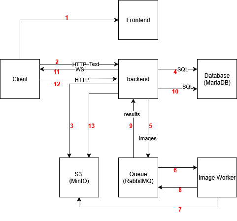

WORK IN PROGRESS

# Technologies

- Backend: TS NodeJS / Express
- Frontend: Angular
- Worker: TS NodeJS
- Database: MariaDB
- File Storage: minIO
- Queue: RabbitMQ
- Deployment: Docker

# Concept



1. **Client** gets frontend from **FRONTEND**
2. **Client** uploads image to **BACKEND**
3. **BACKEND** uploads image to **S3 DATA LAKE**
4. **BACKEND** writes to **DATABASE**
5. **BACKEND** forewards job into **QUEUE**
6. **WORKER** gets job from **QUEUE**
7. **WORKER** gets image from **S3 DATA LAKE**
8. **WORKER** forwareds result into **QUEUE**
9. **BACKEND** gets info from **QUEUE**
10. **BACKEND** writes result into **DATABASE**
11. **BACKEND** writes over webservice to **CLIENT**
12. **CLIENT** asks **backend** for image
13. **BACKEND** gets proccessed image from **S3 DATA LAKE**

# DEV SETUP

Start up db (MariaDB), file storage (minIO) and Queue (RabbitMQ)

```shell
docker-compose up -d --build
cd backend
npm run dev
cd frontend
ng serve
```

Rebuild and rerun just the worker

```shell
docker-compose up -d --build worker
```
